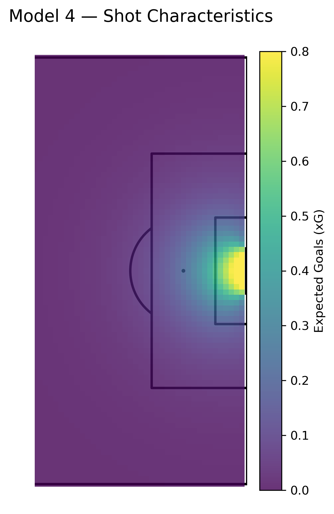

# How to Win the Premier League

Reconstructing football analytics models from first principles, inspired by Ian Graham's *How to Win the Premier League*.

The goal of this repository is not only to reproduce common football analytics models, but to understand **why particular modelling choices are made, how model complexity affects performance, and how the results can be evaluated and communicated using real football data.**

## Current Project: Expected Goals (xG)

The first project develops an expected goals model progressively, starting from a constant-probability baseline and adding increasingly detailed spatial and contextual information.

Five models are compared:

1. Baseline probability model
2. Distance model
3. Distance + angle model
4. Non-linear spatial model
5. Shot-characteristics model

Models are evaluated using:

* Log Loss
* Brier Score
* ROC AUC
* Calibration

The project also includes xG probability surfaces and shot-map visualizations.

  

➡️ **See the xG notebooks and full model comparison for methodology and results.**

## Models

| Model               | Status     | Description                                             |
| ------------------- | ---------- | ------------------------------------------------------- |
| Expected Goals (xG) | ✅ Complete | Estimates the probability that a shot results in a goal |
| Possession Value    | ⬜ Planned  | Estimates the value of each on-ball action   |
| Additional models   | ⬜ Planned  | Further models inspired by the book                     |

## Project Philosophy

For each model, I aim to:

1. Understand the underlying methodology
2. Identify suitable football data
3. Reconstruct the model independently
4. Evaluate predictive performance
5. Compare alternative modelling choices
6. Visualize and interpret the results
7. Document limitations and assumptions

## Data

The current xG project uses **StatsBomb Open Data**.

Raw data is not stored directly in this repository. See [`data/README.md`](data/README.md) for information on obtaining and preparing the data.

## Future Work

The repository will expand beyond expected goals into additional football analytics models, with an emphasis on understanding both their statistical foundations and their practical football applications.

